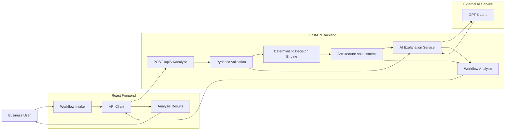
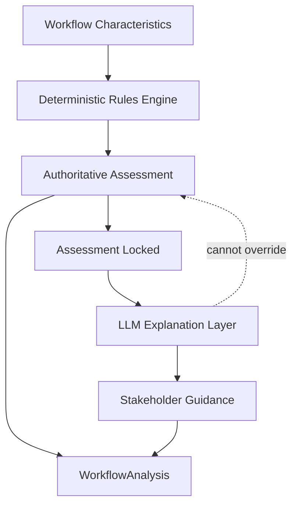
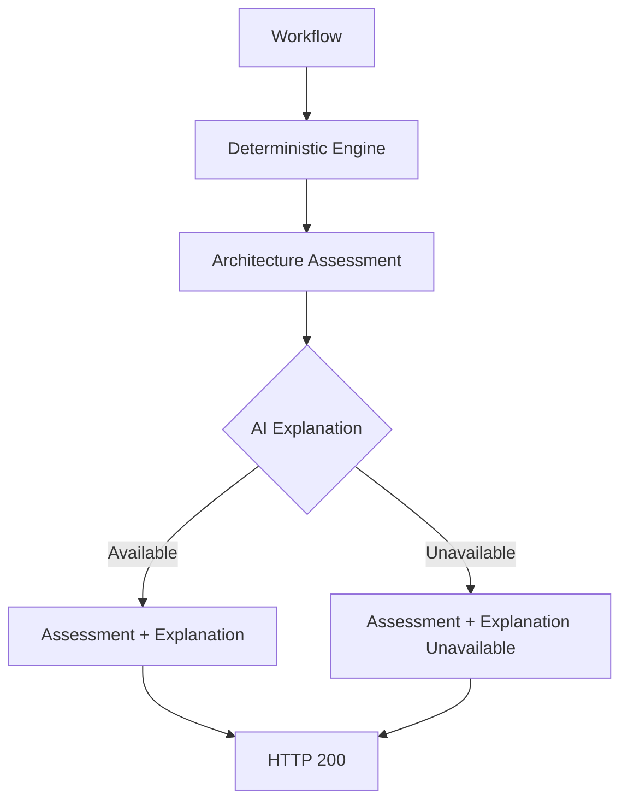

# Marketing AI Workflow Architect

### Gradensal Signature Build - GSB-002

**Choose the right level of AI before you build.**

Marketing AI Workflow Architect is a decision-support prototype that evaluates a business workflow and recommends an appropriate architecture:

- deterministic automation;
- LLM-assisted workflow;
- agentic workflow;
- or human-first redesign.

The system is deliberately designed so that **a deterministic policy layer owns the architecture decision** while generative AI is used only to explain that decision in stakeholder-friendly language.

> **The rule engine decides. The LLM explains.**

---

## Why This Project Exists

Organizations increasingly face a misleading question:

> “Where can we add AI?”

A more useful question is:

> **“What level of automation or AI autonomy does this workflow actually require?”**

Not every workflow needs an agent.

Some workflows are better solved with:

- ordinary deterministic software;
- an LLM embedded inside a human-controlled process;
- a bounded agent with tools;
- or better human process design before any additional autonomy is introduced.

GSB-002 makes those distinctions explicit.

---

# Product Overview

A user describes a workflow and scores six architecture signals:

| Signal | Question |
|---|---|
| Repeatability | How consistently does the workflow follow the same sequence? |
| Ambiguity | How much interpretation or judgment is required? |
| Tool use | How much does the workflow depend on other systems or information sources? |
| External actions | How consequentially does the workflow act on external systems? |
| Business risk | What could happen if the system makes the wrong decision? |
| Data sensitivity | How sensitive is the information handled by the workflow? |

The system then returns:

- a recommended architecture;
- risk level;
- decision strength;
- human-approval requirement;
- deterministic rationale;
- guardrails;
- structured AI explanation;
- proposed first experiment;
- success metric.

---

# The Four Architecture Outcomes

## 1. Deterministic Automation

Use explicit software rules when the workflow is:

- highly repeatable;
- low ambiguity;
- low risk;
- limited in consequential action.

Example:

**Weekly campaign reporting**

```text
Recommendation      DETERMINISTIC AUTOMATION
Risk                LOW
Decision strength   5/5
Human approval      NO
```

The system does not add AI simply because AI is available.

---

## 2. LLM-Assisted Workflow

Use an LLM when generation or interpretation adds value but autonomous execution is unnecessary.

Example:

**Campaign message drafting**

```text
Recommendation      LLM-ASSISTED WORKFLOW
Risk                LOW
Decision strength   4/5
Human approval      NO
```

The LLM supports the marketer while workflow structure and final authority remain explicit.

---

## 3. Agentic Workflow

Use bounded agentic behavior when the workflow requires:

- substantial interpretation;
- several tools or information sources;
- adaptive intermediate decisions;
- meaningful actions;
- bounded risk.

Example:

**Campaign anomaly investigation**

```text
Recommendation      AGENTIC WORKFLOW
Risk                MEDIUM
Decision strength   4/5
Human approval      YES
```

Agentic architecture does not imply unrestricted autonomy.

---

## 4. Keep Human / Redesign First

Do not increase autonomy when risk exceeds the acceptable boundary.

Example:

**Autonomous customer pricing**

```text
Recommendation      KEEP HUMAN / REDESIGN FIRST
Risk                HIGH
Decision strength   5/5
Human approval      YES
```

The workflow should first be redesigned around explicit human control.

---

# Core Architecture



---

# The Important Design Decision

GSB-002 deliberately separates:

```text
DECISION AUTHORITY
        from
GENERATIVE EXPLANATION
```

The architecture recommendation is produced by deterministic rules.

Only after that assessment exists is the LLM called.

The LLM is not permitted to change:

- recommendation;
- risk level;
- decision strength;
- human-approval requirement;
- deterministic rationale;
- deterministic warnings.



This makes the generative model an explanatory layer rather than an uncontrolled policy authority.

---

# Graceful AI Failure

The architecture decision does not depend on the availability of the generative model.

If the AI explanation service fails:

```text
Deterministic engine succeeds
        ↓
AI explanation fails
        ↓
Architecture assessment survives
        ↓
User still receives recommendation
```



The frontend explicitly communicates that:

> The architecture decision remains valid even when the AI explanation is unavailable.

---

# Governance Boundaries

The decision engine includes explicit boundaries around autonomy.

## High risk can override agentic characteristics

A workflow may have:

```text
Ambiguity           5
Tool use            5
External actions    5
```

and appear technically suitable for an agent.

If business risk is also:

```text
Business risk       5
```

the result is:

```text
KEEP HUMAN / REDESIGN FIRST
```

Capability does not override governance.

---

## Sensitive data can constrain autonomy

Extremely sensitive data combined with meaningful external action can trigger human-first redesign even when the workflow otherwise resembles an agentic use case.

---

## Tool count does not equal agency

A workflow using many systems is not automatically agentic.

Integration complexity and autonomous decision-making are different architectural concerns.

---

## Human approval is separate from architecture type

An:

```text
AGENTIC WORKFLOW
```

may still return:

```text
Human approval required
```

Agentic capability does not imply unrestricted permission.

---

# AI Explanation Output

When available, the explanation layer returns six structured fields:

```text
why_this_approach
why_not_more_autonomy
proposed_architecture
human_checkpoint
first_experiment
success_metric
```

The response is validated through a Pydantic schema before being returned to the React application.

This avoids relying on arbitrary free-form model output.

---

# Evaluation

GSB-002 uses layered evaluation rather than relying on a single browser demo.

Current backend baseline:

```text
41 passing tests
```

Run:

```bash
python3 -m pytest backend/tests -q
```

Current verified result:

```text
......................................... [100%]
41 passed
```

The automated suite does not require live OpenAI calls.

---

# What Is Tested

The suite covers:

- workflow-domain validation;
- architecture-assessment validation;
- structured explanation models;
- deterministic decision logic;
- API behavior;
- combined workflow analysis;
- authority boundaries;
- risk overrides;
- sensitive-data overrides;
- agentic bounded-risk behavior;
- AI explanation integration through injected test doubles;
- AI-provider failure resilience.

---

# Canonical Evaluation Matrix

| Workflow | Recommendation | Risk | Strength | Human Approval |
|---|---|---|---:|---|
| Weekly campaign reporting | Deterministic automation | Low | 5/5 | No |
| Campaign message drafting | LLM-assisted workflow | Low | 4/5 | No |
| Campaign anomaly investigation | Agentic workflow | Medium | 4/5 | Yes |
| Autonomous customer pricing | Keep human / redesign first | High | 5/5 | Yes |

Run the deterministic evaluation demo:

```bash
python3 -m scripts.run_decision_demo
```

The demo exercises all four architecture families without calling the external AI service.

---

# API

The FastAPI application exposes:

```text
GET  /health

POST /api/v1/assess

POST /api/v1/analyze
```

## `/api/v1/assess`

Runs the deterministic architecture engine only.

Returns:

```text
ArchitectureAssessment
```

## `/api/v1/analyze`

Runs:

```text
Workflow validation
        ↓
Deterministic assessment
        ↓
AI explanation attempt
        ↓
WorkflowAnalysis
```

If the AI explanation fails, the deterministic assessment remains available.

---

# Frontend

The React frontend provides:

- workflow intake;
- architecture sliders;
- workflow validation;
- responsive UI;
- deterministic result presentation;
- AI explanation presentation;
- loading state;
- API connectivity error state;
- AI-unavailable state;
- disabled controls during analysis;
- keyboard-operable sliders;
- keyboard navigation;
- responsive desktop/tablet/mobile layouts.

---

# Gradensal Product Design

GSB-002 establishes an early Gradensal application design language.

The visual system uses:

- near-black page surfaces;
- deep navy application panels;
- cobalt and electric-blue accents;
- cyan status indicators;
- frost-white typography;
- restrained glass-like surfaces;
- the approved Gradensal chrome-blue sculptural mark.

The frontend is intentionally designed to feel:

```text
technical
premium
restrained
precise
```

rather than visually resembling generic purple SaaS interfaces or gaming software.

---

# Responsive QA

Manual QA was completed at representative widths.

```text
Desktop      1440px+
Laptop       ~1100px
Tablet       768 × 1024
Mobile       390 × 844
```

Verified behaviors include:

- responsive panel stacking;
- responsive hero layout;
- mobile touch targets;
- no unexpected horizontal scrolling;
- mobile slider simplification;
- responsive footer behavior.

---

# Accessibility QA

Manual keyboard testing verified navigation through:

```text
Load example
Reset
Workflow name
Team
Workflow description
Repeatability slider
Ambiguity slider
Tool-use slider
External-actions slider
Business-risk slider
Data-sensitivity slider
Human-approval checkbox
Analyze workflow
```

The score controls also support keyboard arrow adjustment.

Visible focus treatment is provided for interactive controls.

---

# Frontend Validation

The form prevents submission until basic descriptive requirements are met.

Representative minimum constraints:

```text
Workflow name       3 characters
Team                2 characters
Description         20 characters
```

Backend Pydantic validation remains authoritative.

---

# Double-Submission Protection

During an active analysis request:

- text fields are locked;
- textarea is locked;
- sliders are locked;
- approval checkbox is locked;
- Load example is disabled;
- Reset is disabled;
- Analyze workflow is disabled.

This prevents repeated API requests while an analysis is already running.

---

# Technology Stack

## Backend

```text
Python 3.12.6
FastAPI
Pydantic
OpenAI Python SDK
python-dotenv
Uvicorn
pytest
HTTPX2
```

## Frontend

```text
React 19.3.0
React DOM 19.3.0
TypeScript
Vite 8.3.1
@vitejs/plugin-react 6.1.1
```

## AI

```text
OpenAI Responses API
GPT-6 Luna
Structured outputs
```

## Development

```text
Git
GitHub
VS Code
macOS
```

---

# Repository Structure

```text
marketing-ai-workflow-architect/
│
├── backend/
│   ├── app/
│   │   ├── api/
│   │   │   ├── health.py
│   │   │   ├── assessment.py
│   │   │   └── analysis.py
│   │   │
│   │   ├── core/
│   │   │   └── config.py
│   │   │
│   │   ├── models/
│   │   │   ├── workflow.py
│   │   │   ├── assessment.py
│   │   │   ├── explanation.py
│   │   │   └── analysis.py
│   │   │
│   │   ├── services/
│   │   │   ├── decision_engine.py
│   │   │   └── explanation_service.py
│   │   │
│   │   └── main.py
│   │
│   └── tests/
│
├── frontend/
│   ├── public/
│   │   └── favicon.png
│   │
│   ├── src/
│   │   ├── assets/
│   │   │   └── gradensal-logo.png
│   │   │
│   │   ├── components/
│   │   │   ├── ScoreField.tsx
│   │   │   └── WorkflowForm.tsx
│   │   │
│   │   ├── services/
│   │   │   └── analysisApi.ts
│   │   │
│   │   ├── styles/
│   │   │   ├── tokens.css
│   │   │   ├── global.css
│   │   │   ├── app.css
│   │   │   ├── analysis.css
│   │   │   └── polish.css
│   │   │
│   │   ├── types/
│   │   │   ├── workflow.ts
│   │   │   └── analysis.ts
│   │   │
│   │   ├── App.tsx
│   │   └── main.tsx
│   │
│   ├── .env.example
│   ├── index.html
│   └── package.json
│
├── scripts/
│   ├── __init__.py
│   ├── run_decision_demo.py
│   └── run_ai_explanation_demo.py
│
├── docs/
│   ├── architecture/
│   │   └── system-architecture.md
│   │
│   └── evaluation/
│       └── evaluation-report.md
│
├── assets/
│   ├── brand/
│   │   └── gradensal-logo-master.png
│   │
│   ├── screenshots/
│   ├── diagrams/
│   └── demo/
│
├── case-study/
│
├── .env.example
├── .gitignore
├── BUILD_LEDGER.md
├── PROJECT.md
├── README.md
├── requirements.txt
└── requirements-dev.txt
```

---

# Run Locally

## 1. Clone the Repository

```bash
git clone https://github.com/Gradensal/marketing-ai-workflow-architect.git

cd marketing-ai-workflow-architect
```

---

## 2. Create the Backend Environment

```bash
python3 -m venv .venv

source .venv/bin/activate
```

Upgrade pip:

```bash
python3 -m pip install --upgrade pip
```

Install dependencies:

```bash
python3 -m pip install -r requirements-dev.txt
```

---

## 3. Configure Backend Environment Variables

Copy:

```bash
cp .env.example .env
```

Configure:

```text
APP_ENV=development

OPENAI_API_KEY=your_openai_api_key

OPENAI_MODEL=gpt-6-luna
```

Never commit `.env`.

---

## 4. Run Backend Tests

```bash
python3 -m pytest backend/tests -q
```

Expected current baseline:

```text
41 passed
```

---

## 5. Run the Deterministic Demo

```bash
python3 -m scripts.run_decision_demo
```

This does not require a live OpenAI request.

---

## 6. Start FastAPI

```bash
python3 -m uvicorn backend.app.main:app --reload
```

Backend:

```text
http://127.0.0.1:8000
```

Swagger:

```text
http://127.0.0.1:8000/docs
```

---

## 7. Configure the Frontend

Open another terminal:

```bash
cd frontend
```

Install dependencies:

```bash
npm install
```

Copy the environment template:

```bash
cp .env.example .env
```

The development API configuration is:

```text
VITE_API_BASE_URL=http://127.0.0.1:8000
```

Do not place the OpenAI API key in the frontend.

Values prefixed with `VITE_` are browser-accessible.

---

## 8. Start React

```bash
npm run dev
```

Open:

```text
http://localhost:5173
```

---

# Production Frontend Build

From:

```text
frontend/
```

run:

```bash
npm run build
```

The Vite production bundle is generated in:

```text
frontend/dist/
```

---

# Environment Separation

Backend secrets remain in the project-root `.env`.

Frontend configuration lives in:

```text
frontend/.env
```

The frontend only knows the FastAPI base URL.

It never receives the OpenAI API key.

---

# Development CORS

During local development, FastAPI allows requests from:

```text
http://localhost:5173

http://127.0.0.1:5173
```

Production CORS policy should be replaced with the final deployment origin.

---

# Key Engineering Decisions

## Deterministic First

Architecture recommendations are explicit and testable.

The model is not asked:

> “What architecture do you think we should use?”

The decision engine already knows the prototype policy.

---

## Least Necessary Autonomy

The project follows the principle:

> **Use the least autonomous architecture that can responsibly solve the problem.**

This prevents unnecessary agentification.

---

## AI as Translation Layer

The generative model converts the architecture result into:

- stakeholder explanation;
- implementation framing;
- first experiment;
- success metric.

It does not own policy.

---

## Typed Boundaries

Pydantic and TypeScript models define the contract on both sides of the network boundary.

```text
Python WorkflowAnalysis
        ↓
       JSON
        ↓
TypeScript WorkflowAnalysis
```

---

## Graceful Degradation

An external AI-provider outage should not erase a valid deterministic result.

The application therefore degrades from:

```text
assessment + explanation
```

to:

```text
assessment + explanation unavailable
```

rather than:

```text
total failure
```

---

# Prototype Limitations

GSB-002 is a Signature Build and engineering prototype.

It does not currently include:

- authentication;
- authorization;
- persistent workflow storage;
- organization-specific policy configuration;
- production telemetry;
- production rate limiting;
- enterprise secrets infrastructure;
- workflow history;
- policy administration;
- cost dashboards;
- deployment infrastructure;
- formal compliance controls.

The current scoring policy is intentionally explicit and testable, but it is prototype logic rather than a universal enterprise decision standard.

Organization-specific deployment would require additional:

- security review;
- privacy review;
- legal review;
- compliance review;
- policy calibration;
- operational monitoring.

---

# What This Project Demonstrates

GSB-002 demonstrates practical experience with:

### AI architecture

- deterministic vs generative responsibilities;
- LLM-assisted workflows;
- agentic workflows;
- authority boundaries;
- structured AI output;
- graceful degradation.

### Software engineering

- typed domain models;
- service separation;
- FastAPI;
- React;
- TypeScript;
- REST APIs;
- dependency injection;
- automated testing;
- responsive interface design.

### AI governance

- human approval;
- bounded autonomy;
- risk-aware architecture selection;
- sensitive-data constraints;
- explicit decision authority;
- AI-provider failure handling.

### Product thinking

- translating architecture decisions into stakeholder guidance;
- minimizing unnecessary AI complexity;
- designing explainable system behavior;
- connecting technical policy to usable business interfaces.

---

# Deeper Documentation

## System Architecture

See:

```text
docs/architecture/system-architecture.md
```

Includes:

- end-to-end architecture;
- authority boundary;
- recommendation logic;
- graceful degradation;
- frontend/backend structure;
- governance boundaries.

---

## Engineering Evaluation

See:

```text
docs/evaluation/evaluation-report.md
```

Includes:

- 41-test baseline;
- four canonical scenarios;
- authority-boundary evaluation;
- AI-failure evaluation;
- responsive QA;
- accessibility QA;
- evidence limitations.

---

# Status

```text
Project foundation                 Complete
Domain models                      Complete
Deterministic decision engine      Complete
FastAPI API                        Complete
Structured AI explanation         Complete
Graceful AI failure                Complete
React product UI                   Complete
Responsive QA                      Complete
Accessibility QA                   Complete
Backend tests                      41 passing
Architecture documentation         Complete
Engineering evaluation             Complete
GitHub release                     Pending
Case study                         Pending
```

---

# Project Philosophy

AI systems should not maximize autonomy by default.

The better architecture question is:

> **What is the least autonomous system that can responsibly accomplish the work?**

Sometimes the answer is ordinary software.

Sometimes it is an LLM.

Sometimes it is an agent.

Sometimes the right answer is to redesign the human process first.

GSB-002 is an exploration of how to make that choice explicit.

---

# About Gradensal

**Gradensal** explores AI systems, intelligent automation, and custom software designed around real business operations.

GSB-002 is part of the **Gradensal Signature Builds** series: focused technical prototypes created to investigate practical AI architecture, governance, automation, and product design.

---

# Author

**Lissette Gorrin Rodriguez**

AI Builder × Storyteller

Gradensal

Toronto, Canada

---

## License

This repository is provided as a portfolio and educational prototype unless otherwise stated.

No warranty is provided for production, legal, compliance, security, financial, or other high-impact use.