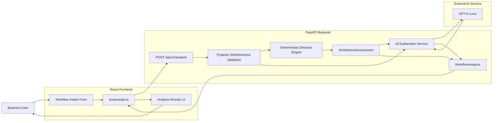
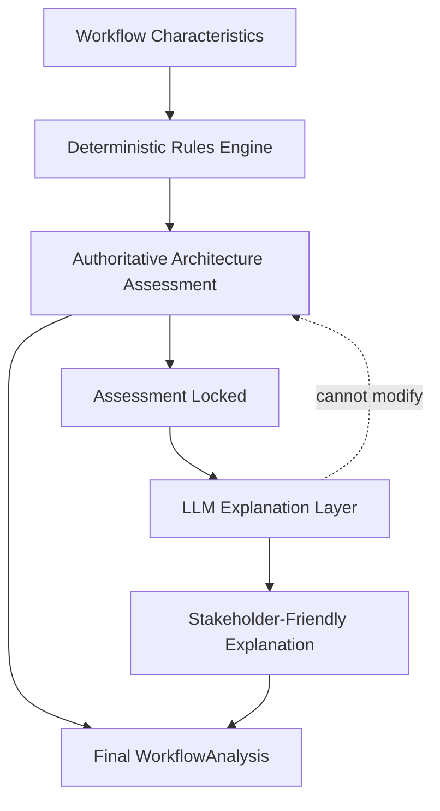
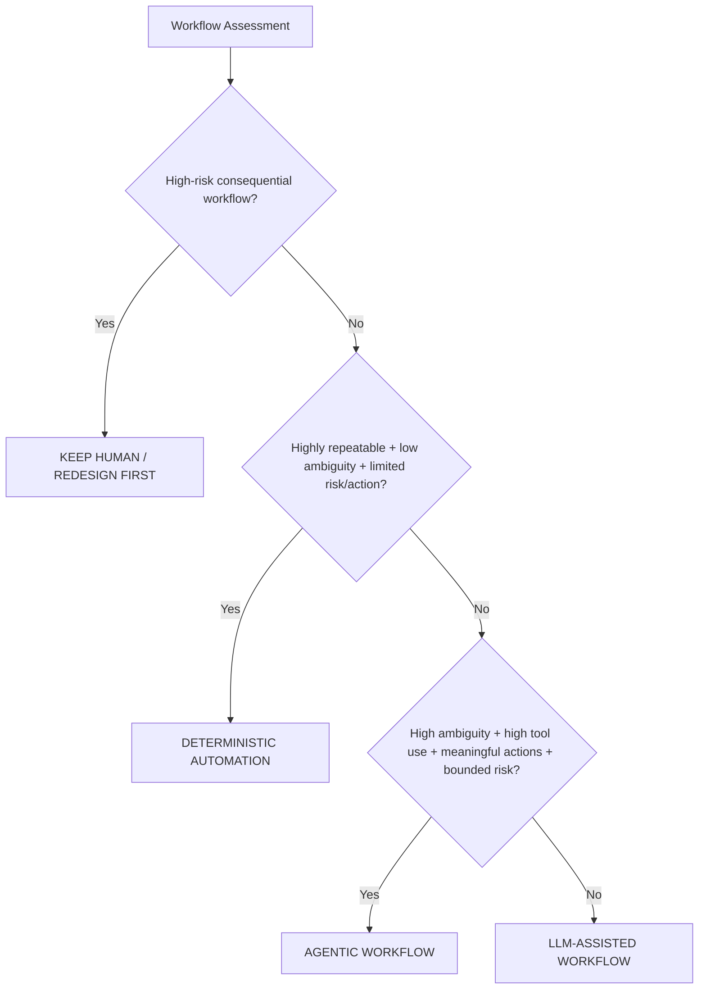
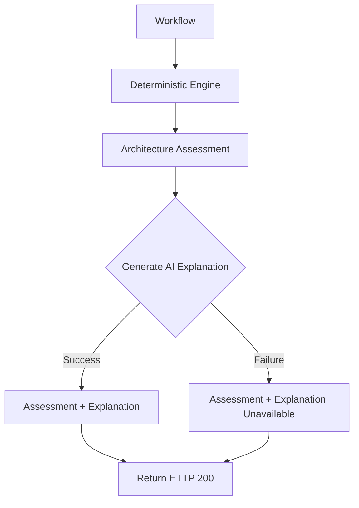

# GSB-002 — Marketing AI Workflow Architect

## System Architecture

**Project:** Gradensal Signature Build GSB-002  
**Product:** Marketing AI Workflow Architect  
**Author:** Lissette Gorrin Rodriguez  
**Organization:** Gradensal  

---

## 1. Architecture Purpose

The Marketing AI Workflow Architect is a decision-support system for evaluating how much automation or AI autonomy a business workflow actually requires.

The system deliberately separates two responsibilities:

1. **Architecture decision authority**
2. **Generative explanation**

The architecture recommendation is produced by an explicit deterministic rules engine.

The large language model does not choose the recommendation.

Instead, the LLM receives the already-completed architecture assessment and translates it into stakeholder-friendly guidance.

This separation allows the system to combine:

- deterministic decision logic;
- testability;
- explicit governance boundaries;
- human approval rules;
- structured AI explanations;
- graceful degradation when the AI provider is unavailable.

---

# 2. End-to-End Architecture



---

# 3. Authority Boundary

The central architectural principle is:

> **The deterministic engine owns the decision. The LLM explains the decision.**

The generative model is not permitted to change:

- the architecture recommendation;
- risk level;
- decision strength;
- human-approval requirement;
- deterministic rationale;
- warnings generated by the rules engine.



This prevents the generative model from becoming an uncontrolled decision authority.

---

# 4. Workflow Input Model

Each workflow is evaluated using a combination of descriptive information and six architecture signals.

## Descriptive Fields

- workflow name;
- team;
- workflow description.

## Architecture Signals

Each signal uses a score from `1` to `5`.

### Repeatability

How consistently the workflow follows the same sequence.

- `1` — changes often
- `5` — highly repeatable

### Ambiguity

How much interpretation or judgment the workflow requires.

- `1` — clear rules
- `5` — high judgment

### Tool Use

How much the workflow depends on external systems or information sources.

- `1` — few tools
- `5` — many systems

### External Actions

How consequentially the workflow changes or acts on external systems.

- `1` — mostly read-only
- `5` — consequential external action

### Business Risk

Potential impact of an incorrect decision.

- `1` — minor impact
- `5` — severe impact

### Data Sensitivity

Sensitivity of information handled by the workflow.

- `1` — public or low sensitivity
- `5` — highly sensitive

The workflow also records whether human approval is already mandatory.

---

# 5. Architecture Recommendation Families

The deterministic engine can return one of four architecture recommendations.



---

## 5.1 Deterministic Automation

Use explicit software rules when the workflow is:

- highly repeatable;
- low ambiguity;
- low business risk;
- limited in consequential external action.

Example:

**Weekly campaign reporting**

The system does not add AI merely because AI is available.

---

## 5.2 LLM-Assisted Workflow

Use an LLM when interpretation or generation adds value but autonomous execution is unnecessary.

Example:

**Campaign message drafting**

The LLM helps produce drafts while workflow structure and final authority remain explicit.

---

## 5.3 Agentic Workflow

Use bounded agentic behavior when the workflow requires:

- substantial interpretation;
- several tools or information sources;
- adaptive behavior;
- meaningful intermediate decisions;
- bounded business and data risk.

Example:

**Campaign anomaly investigation**

Agentic execution still requires observability, bounded permissions, failure handling, and human checkpoints for consequential actions.

---

## 5.4 Keep Human / Redesign First

Do not increase autonomy when workflow risk exceeds the acceptable boundary.

Typical triggers include:

- high business risk combined with consequential external actions;
- extremely sensitive information combined with meaningful external action.

Example:

**Autonomous customer pricing**

The recommendation is to redesign the workflow around explicit human control before considering additional autonomy.

---

# 6. Human Approval Logic

Human approval may be required even when the architecture recommendation is not human-first.

Approval can be triggered by:

- an existing mandatory approval requirement;
- meaningful business risk;
- highly consequential external actions;
- highly sensitive data.

This means:

```text
Agentic workflow
does not mean
unrestricted autonomous execution.
```

The architecture recommendation and the approval requirement are separate decisions.

---

# 7. AI Explanation Layer

After the deterministic assessment is complete, the explanation service receives:

- the original workflow characteristics;
- the authoritative architecture recommendation;
- risk level;
- decision strength;
- human-approval requirement;
- rationale;
- warnings.

The LLM returns six structured explanation fields:

1. `why_this_approach`
2. `why_not_more_autonomy`
3. `proposed_architecture`
4. `human_checkpoint`
5. `first_experiment`
6. `success_metric`

The response is validated against a Pydantic schema before being returned to the frontend.

---

# 8. Graceful Degradation

The generative explanation is useful, but it is not required for the architecture decision to remain valid.

If the external AI service fails, GSB-002 preserves the deterministic assessment.



The user still receives:

- recommendation;
- risk level;
- decision strength;
- human-approval requirement;
- deterministic rationale;
- guardrails.

The interface clearly states that the AI explanation is temporarily unavailable while the deterministic recommendation remains valid.

---

# 9. Failure Boundaries

GSB-002 distinguishes several failure classes.

## Input Validation Failure

Handled by:

- frontend constraints;
- Pydantic backend validation.

Invalid input does not reach the architecture engine.

---

## API Connectivity Failure

If the React application cannot reach FastAPI:

- the workflow remains in the browser;
- the user receives a controlled error message;
- the application does not fail silently.

---

## AI Provider Failure

If the generative explanation service fails:

- the deterministic assessment is preserved;
- the endpoint still returns a valid workflow analysis;
- `explanation_status` becomes `unavailable`;
- the UI explains that the architecture recommendation remains authoritative.

---

# 10. Frontend Architecture

```text
frontend/
├── src/
│   ├── assets/
│   │   └── gradensal-logo.png
│   │
│   ├── components/
│   │   ├── ScoreField.tsx
│   │   └── WorkflowForm.tsx
│   │
│   ├── services/
│   │   └── analysisApi.ts
│   │
│   ├── types/
│   │   ├── workflow.ts
│   │   └── analysis.ts
│   │
│   ├── styles/
│   │   ├── tokens.css
│   │   ├── global.css
│   │   ├── app.css
│   │   ├── analysis.css
│   │   └── polish.css
│   │
│   ├── App.tsx
│   └── main.tsx
│
├── public/
│   └── favicon.png
│
├── .env.example
└── package.json
```

The frontend deliberately separates:

- reusable interface components;
- domain types;
- API communication;
- brand tokens;
- product layout;
- analysis presentation;
- final polish.

---

# 11. Backend Architecture

```text
backend/
├── app/
│   ├── api/
│   │   ├── health.py
│   │   ├── assessment.py
│   │   └── analysis.py
│   │
│   ├── core/
│   │   └── config.py
│   │
│   ├── models/
│   │   ├── workflow.py
│   │   ├── assessment.py
│   │   ├── explanation.py
│   │   └── analysis.py
│   │
│   ├── services/
│   │   ├── decision_engine.py
│   │   └── explanation_service.py
│   │
│   └── main.py
│
└── tests/
```

The backend follows the same separation-of-concerns principle:

```text
API
 ↓
domain validation
 ↓
decision service
 ↓
explanation service
 ↓
structured response
```

---

# 12. Security and Governance Boundaries

The prototype intentionally does not:

- allow the LLM to override deterministic architecture policy;
- expose the OpenAI API key to the React frontend;
- place secrets inside `VITE_*` environment variables;
- automatically perform consequential business actions;
- treat agentic architecture as unrestricted autonomy;
- replace organization-specific security, privacy, legal, or compliance review.

The OpenAI API key exists only in the backend environment.

The frontend receives only the application API address.

---

# 13. Evaluation Strategy

The project validates behavior at multiple layers.

## Unit and Domain Tests

Tests cover:

- workflow validation;
- architecture assessment validation;
- decision-engine behavior;
- authority boundaries;
- structured explanation models.

## API Tests

Tests verify:

- health endpoint behavior;
- deterministic assessment endpoint;
- combined analysis endpoint;
- dependency-injected explanation generation.

## Resilience Tests

Tests prove that:

- AI explanation success produces a complete result;
- AI explanation failure preserves the deterministic assessment.

## Current Automated Test Baseline

```text
41 passing backend tests
```

---

# 14. Reference Evaluation Scenarios

| Workflow | Recommendation | Risk | Decision Strength |
|---|---|---|---:|
| Weekly campaign reporting | Deterministic automation | Low | 5/5 |
| Campaign message drafting | LLM-assisted workflow | Low | 4/5 |
| Campaign anomaly investigation | Agentic workflow | Medium | 4/5 |
| Autonomous customer pricing | Keep human / redesign first | High | 5/5 |

These scenarios demonstrate all four architecture families.

---

# 15. Core Design Principle

The project is based on a simple principle:

> **Use the least autonomous architecture that can responsibly solve the problem.**

More AI is not automatically better architecture.

A workflow may need:

- ordinary deterministic software;
- an LLM assistant;
- a bounded agent;
- or better human process design.

The purpose of GSB-002 is to make that distinction explicit before implementation begins.

---

# 16. Architecture Summary

GSB-002 demonstrates a hybrid AI architecture in which:

```text
Deterministic policy
        ↓
owns the architecture decision

Generative AI
        ↓
translates the decision into usable guidance

Human governance
        ↓
remains explicit for consequential workflows
```

This separation improves:

- explainability;
- testability;
- resilience;
- governance;
- operational clarity;
- stakeholder trust.

The result is not an AI system designed to maximize autonomy.

It is a decision-support system designed to select the **appropriate** amount of autonomy.